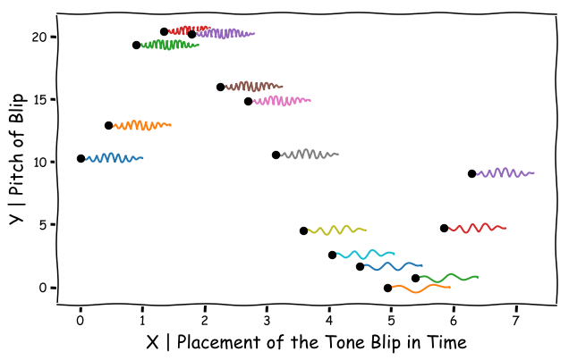

# `sonipy` : A Scatterplot Sonification Package

A package to turn scatter plots into perceptually uniform sound files for use in science and to make science more accessible.

This project was developed by [Locke Patton](https://twitter.com/Astro_Locke) and [Prof. Emily Levesque](https://twitter.com/emsque). Click [here](https://twitter.com/Astro_Locke/status/1083510515857408000) for a twitter thread explaining the motivation behind this project.

## What does `sonipy` do?

Here is an [example sonification](https://twitter.com/Astro_Locke/status/1083510562187751424).

Our method of sonification takes in scatterplot data and produces audio clips that depict each datapoint as a short sound blip with a y value corresponding to pitch and an x value corresponding to arrival time.



**Each data point has a corresponding short tone called a `blip`,** with a y value corresponding to its pitch and a x value corresponding to its arrival time. Higher y value data points have higher corresponding blip pitches.

## Installation

`sonipy` is pip-installable from command line:

``` bash
pip install sonipy
```

Alternately, you can clone the repository and install it yourself:

``` bash
git clone https://github.com/lockepatton/sonipy.git
cd sonipy
python setup.py install
```


## Example Easy Setup

``` Python
from sonipy.sonify import SonifyTool

Tone = SonifyTool(x, y)
Tone.play()
Tone.save()
```

## Extended Setup

``` Python
from sonipy.sonify import SonifyTool

C4 = 261.6 # Hz
frequency_args = {
  'frequency_min' : C4,
  'frequency_max' : C4*4
  # 'cents_per_value' : -680,
  # 'value_min' : 0,
  # 'value_max' : 1,
}

duration_args = {
  'time_total' : 2000, # ms
  # 'time_min' : 100, # ms
  # 'time_max' : 800, # ms
}

duration_scale = 1. / 2000. # x value / time (ms)

Tone = SonifyTool(x, y,
                  frequency_args = frequency_args,
                  duration_args = duration_args,
                  # duration_scale = duration_scale,
                  bliplength=0.5)

Tone.play()
Tone.SaveTone()
```

## Parameter Inputs

### Frequency Scale Parameters:

1. a minimum frequency  and it's corresponding minimum y value 
2. a maximum frequency  and it's corresponding maximum y value 
3. a change in pitch (measured in [cents](https://en.wikipedia.org/wiki/Cent_(music))) over change in y value parameter 

All frequency parameters are entered inside the args parameter.

### Time Scale Parameters:

By default, the sound files are 2 seconds.

1. a total time of the soundfile 
2. a change in time (measured in seconds) over change in x value parameter 

Time parameters are entered by simply by defining a duration_scale (in seconds per x value). Or alternately by passing a duration_args dictionary with some total time, smallest delta time between points or max delta time between points.

## Demos
Several Jupyter notebooks that demonstrate some use cases and examples of sonipy are found
[here](https://github.com/lockepatton/sonipy/tree/master/demos).

## TransientZoo Motivation

This  code  was  developed  as  part  of  TransientZoo,  a  citizen  science  program  that  will  allow  participants,  including  blind and visually impaired individuals, to classify supernova lightcurves using sound. In astronomy, lightcurves depict variations in brightness of a specific astrophysical object as a function of time. For more, see [this summary](https://twitter.com/Astro_Locke/status/1083510515857408000) twitter thread and poster from the 235th American Astronomical Meeting.

## Attribution

If you find the package useful in your research, please cite our JOSS paper.
