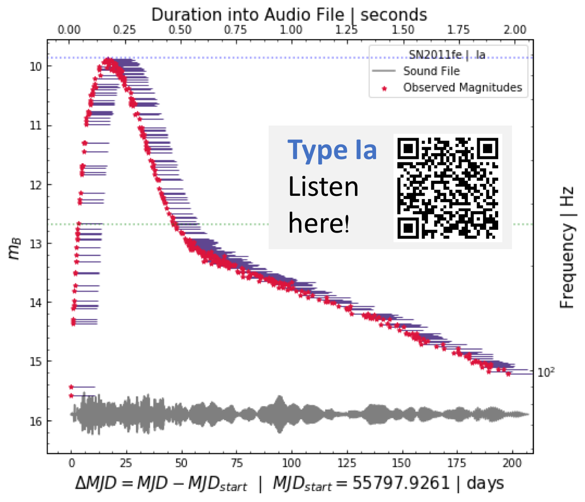
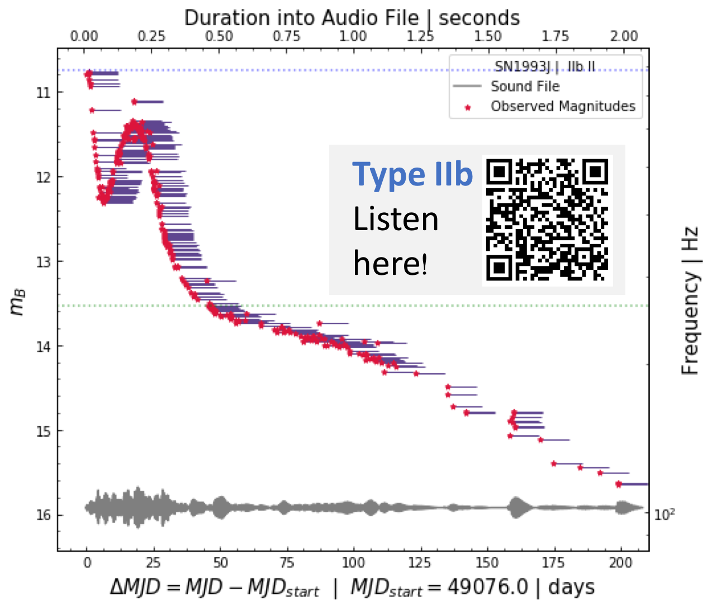
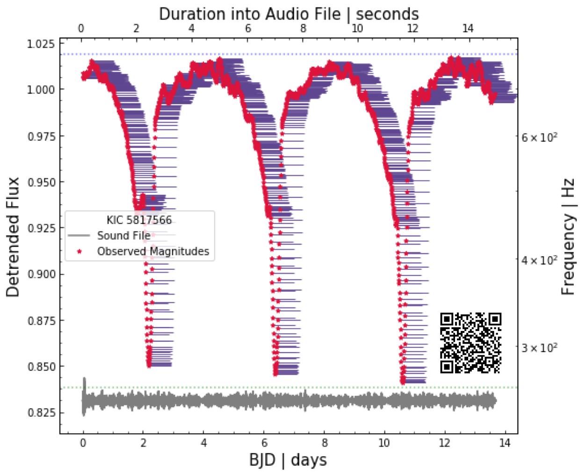
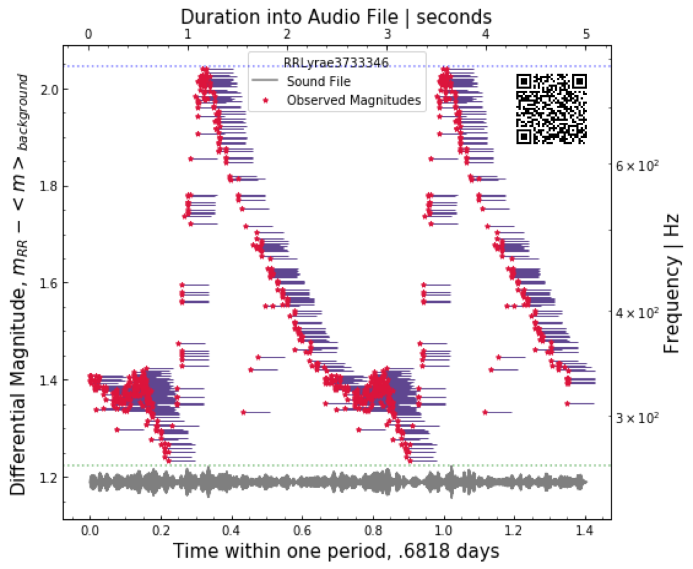

# Introduction

`soni-py` moves beyond visual analyses by sonifying scatter-plot data, producing audio files that depict variations in y as perceptually uniform changes in pitch. Short tones - called blips - are sounded in time at intervals corresponding to x values.

The addition of this audio sonification to a scientist's toolset has the intention of creating more inclusive and accessible science, new attention grabbing public outreach opportunities, and an easier self-consistent scientific understanding of minor differences in data over large scales.

## Understanding pitch

The cent is a logarithmic unit of measure for pitch intervals where $n \approx 3986\log(b/a)$ defines the number of cents between the pitch frequencies a and b.

## Human Pitch Sensitivity

The average person is capable of discerning independent subsequent pitches with a difference of ~10 cents [@Kollmeier:2008]. The human ear is most sensitive to frequencies between $\sim$500-4000 Hz, similar to the range of a standard piano.

With these parameters, xy scatterplot data can be translated into audio files that map y values to specific pitch frequencies, with the minimum discernible $\Delta y$ corresponding to a 10 cent pitch difference.

# Scientific Need

This `soni-py` code is specifically designed to create an open-access scientifically useful method to listen to data, with accuracy and use on par with reading plots visually. While many sonification tools exist, this was specifically designed in collaboration with the University of Washington Speech and Hearing Sciences to guarantee that a linear increase in y value will correspond to a uniform increase in perceived “pitch”. This means that while frequency varies non linearly, the user is listening to data in a uniformly perceived way - a linear plot sounds like a linear sweep in pitch. The guarantees the user self consistency when translating from a visual medium to an audio medium. Furthermore, this technique allows us to probe smaller difference in y values than we can discern visually. We’ve also found that we can hear periodic details in data that are not easily visually discerned from a plot alone.

Thanks to the nature of human hearing, we can audibly discern subsequent pitch differences of 10 cents (a logarithmic measure of pitch interval). On a y scale ranging from 0 to 10, that corresponds to hearing variations as small as dy~0.03 - a number which rivals our visual perceptions of scatter plot detail. This simultaneous depth and range makes pitch-varied audio an incredibly powerful and accessible tool for understanding nuances in data. This approach also opens up science and citizen science to participants who are visually impaired, and empowers blind and visually impaired (BVI) individuals to explore their own data.

In fact, this code was specifically designed for this use case. Already it’s been used by students at Perkin’s School for the Blind, a semester Ohio State Astronomy Program for BVI high school students, and is the foundation for our NSF-funded TransientZoo project, a citizen science program that will allow participants, including BVI individuals, to classify astronomical supernova lightcurves using sound.

# State of the Field

Sonification of scientific data has a long history of precedent. The most relevant projects have been completed by SYSTEM Sounds, run by Matt Russo, with the intent of public astronomy outreach through sonifications. He and his team have used various sonic methods to produce auditory experiences of data, ranging from an exoplanet period correlated with musical beats to a scan across pictures of Saturn's ring matching image components to pitch and volume. Most similar to our work is his sonification of a Hubble image of a galaxy cluster - time flows from left to right across the image while the frequency of sound changes from bottom to top of the image; the brightness at any point correlates with loudness. Other works that sonify supernovae have been completed by Alicia Soderberg and Raffaella Margutti, matching different musical instrument sounds to different wavelength regimes and correlating the brightness of an object with pitch or loudness. In the field of astronomy more generally, the LIGO collaboration famously produces sound files mapping a 2D histogram of a black hole merger's gravitational wave signal to pitch and matching gravitational wave frequency to sound frequency (creating the distinctive upward ``chip" sound now associated with gravitational wave mergers).

However, with all of these sonification tools the purpose of the sound is to communicate science rather than to aurally analyze the data or increase research accessibility. Our code implements a sonification method that is perceptually consistent (using scientific measures of pitch perception rather than harder-to-discern variations such as loudness). This allows users to reliably analyze scatter plots by listening to them, making this the first sonification tool suitable for scientific research. Future data sonification codes in astronomy, such as `astronify`, are already building upon our core method, and potential applications in the field include collaborations with large survey projects in astronomy such as the Zwicky Transient Facility and the Vera C. Rubin Observatory.

# Our Sonification Technique

As seen in Figure \autoref{fig:method}, we built our technique so that each xy data point has a corresponding short tone called a blip. The y value of a given data point corresponds to the pitch of its blip, while the x value corresponds to the placement of the blip in time. More sampled x values have a great blip density in time, and as y value increases or decreases, the tone's pitch gets higher or lower, respectively.

![Each data point corresponds to a short tone or \"blip\" in the sound file. Here the x and y values of a sine function with some noise are shown in black. The x value of a given data point determines the placement of the tone in time. The y value determines the tone's pitch. Beside each data point, we've placed a visualization of its blip, shown in color. This blip trail, with a length corresponding to the duration of the blip, shows the variation of the amplitude of the pitch at its frequency. Note that as the values get higher, the corresponding frequency of the blip increases greatly indicating a higher pitch. All of these blips are combined in time to create the sound file.\label{fig:method}](./images/Method1.png)

## Y Values: Pitch

The y value of a given data point determines the tone's pitch. A complete well-defined y frequency scale has the following parameters:

1.  A minimum frequency $f_{min}$ and its corresponding minimum y value $y_{min}$
2.  A maximum frequency $f_{max}$ and its corresponding maximum y value $y_{max}$
3.  A change in pitch (measured in cents) over change in y value parameter $\frac{dc}{dy}$

Fundamentally these values must be related via the following equation.

$$f_{min} = \frac{f_{max}}{2^{\frac{dc}{dy} [y_{max} - y_{min}] ~/~ 1200}}$$

We then relate any given y value to its corresponding frequency $f$ via the following relationship.

$$f = \frac{f_{max}}{2^{\frac{dc}{dy} [y_{max} - y] ~/~ 1200}}$$

Our code accepts either a maximum frequency and cent scale slope parameter or a maximum and minimum frequency to create a given frequency scale.

## X Values: Placement of Tones in Time

The x value determines the placement of the tone in time. A complete well-defined x time scale has the following parameters:

1.  A minimum x value $x_{min}$
2.  A maximum x value $x_{max}$
3.  A total time of the sound file $t_{total}$
4.  A change in time (measured in seconds) over change in x value parameter $\frac{dt}{dx}$

$$t = \frac{dt}{dx} [x - x_{min}]$$

Our code accepts a total time, a smallest time difference between subsequent points, a largest time difference between subsequent points, or a value for the $\frac{dt}{dx}$ parameter to create the time scale.

# Why this method?

Each datapoint corresponds to a tone blip at a frequency specified by its y value and a time specified by its x value. As the sound file plays, it scans the plot left to right, with higher y datapoints causing higher-pitched blips and vice versa.

Our method is tailored to the capabilities of the human ear and audio equipment. It is flexible, applies to a broad variety of data inputs, is fast to generate, and offers a unique means of classifying data.

We avoid methods that match changes in y to decibels, because human perception of loudness is inconsistent across users and not a perceptually uniform space. As our method is tailored to a science case, a linear increase in y corresponds to a perceptually uniform and linear increase in perceived pitch.

# Our Astronomy Case Study

## Citizen Science - Supernova Lightcurves

This code was developed as part of TransientZoo, a citizen science program that will allow participants, including BVI individuals, to classify supernova lightcurves using sound. In astronomy, lightcurves depict variations in brightness of a specific astrophysical object as a function of time. The shape of these lightcurves are different depending upon the nature of the star or object creating the bright supernova explosion.

Figure \autoref{fig:Ia} and \autoref{fig:IIb} are two examples of successfully sonified audio light curves, for a Type IIb and Type Ia supernovae. We find that linear and plateau supernova light curves can be audibly differentiated. This approach offers a new tool for citizen science lightcurve classification.

## Other Variable Objects in Astronomy

We've also explored the sonification of other time-domain data, which will eventually help TransientZoo expand into LightcurveZoo. Figures \autoref{fig:EB} and \autoref{fig:RRLyrae} show examples of an eclipsing binary from Kepler's catalogue and an RR Lyrae from the author's own telescope observations. LightcurveZoo will ultimately include a collection of transients: supernovae, binaries, and variable stars.

# Acknowledgements

Special thanks to Dr. Chris Laws and Manastash Ridge Observatory for acquisition of some of our example observations, and to Dr. Christi Miller from the Department of Speech and Hearing Sciences at the University of Washington for her consultation on the topic of human pitch perception. This work was supported by NSF grant AST 1714285 awarded to E.M.L.

# References
